# Projet INFO834

---
# 3/ Insertion de données

Avant de pouvoir faire des tests sur des données, il faut d'abord en importer nous utilisons ici la commande mongoimport:

```shell
mongoimport -d=France -c=communes --type csv communes-departement-region.csv --headerline
```

# 4/ Commande de base

Dans cette partie, je vais tester différentes commandes de base

* show databases

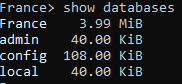

* use France

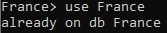

* show collections

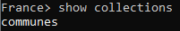

* db.communes.count()


* db.communes.find()

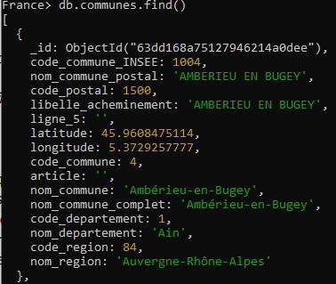

* db.communes.find().pretty()

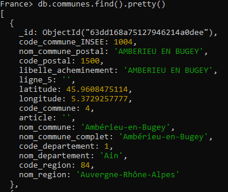

# 6/ Utilisation de curseurs

Lorsqu'il est nécessaire d'afficher de nombreuses données, il est référable d'utiliser des curseurs comme suit :

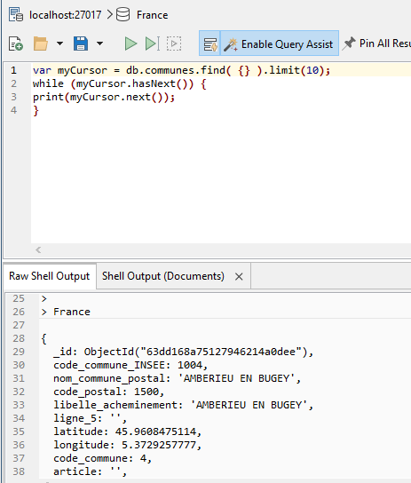

# 7/ Benchmark

Nous cherchons maintenant à lire chaque documents de la collection avec une recherche par nom de commune en calculant le temps nécessaire. j'ai ainsi crée un script appelé **benchmark.py** qui effectue la recherche et retourne le temps necessaire pour effectuer cette tache.

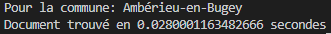

# 8/ Index

L'unicité est possible dans la bases des communes.

Les index peuvent être :

* nom_commune
* nom_commune_INSEE
* code_postal
* code_commune_INSEE

Nous testons de nouveau notre script après avoir mit en place un index sur le nom de la commune grâce à la commande suivante:

```shell
db.communes.createIndex( { nom_commune : 1 } )
```
Nous obtenons le résultat suivant:

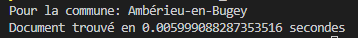

Nous observons ici un gain de temps conséquent

# 9/ BDD Analytics

Je crée la base de données Analytics en inserant un document dans une nouvelle collection:


j'incrémente maintenant l'attribut **nb** du nouveau document:

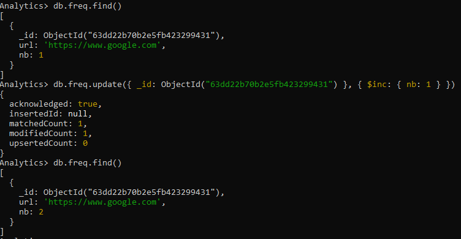


# 10/ Utilisation d'Array dans les documents

Dans cette partie, j'initialise dans un premier temps la base de données mailing avec une collection nommé **lists** dans laquelle j'insert un document composé des attributs **name** et **emails**:

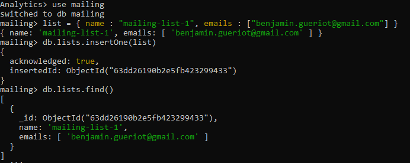

j'ajoute maitenant un nouveau element a ma liste d'email:

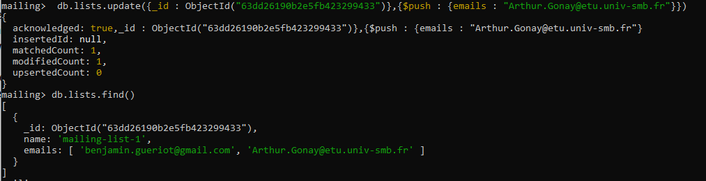

je peux également retirer un email de cette liste:

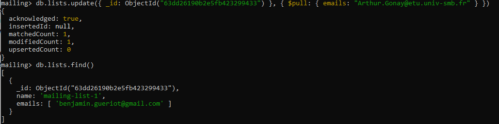

# 11/ Liaision des documents

Nous cherchons à lier des documents pour cela je créer une collection **users** contenant 3 utilisateurs:

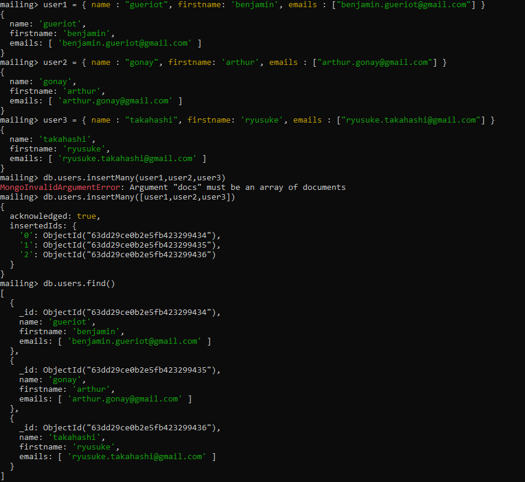

Pour lier les deux documents il m'est necessaire de supprimer la collection **lists** pour en créer une nouvelle contenant les id des utilisateurs:

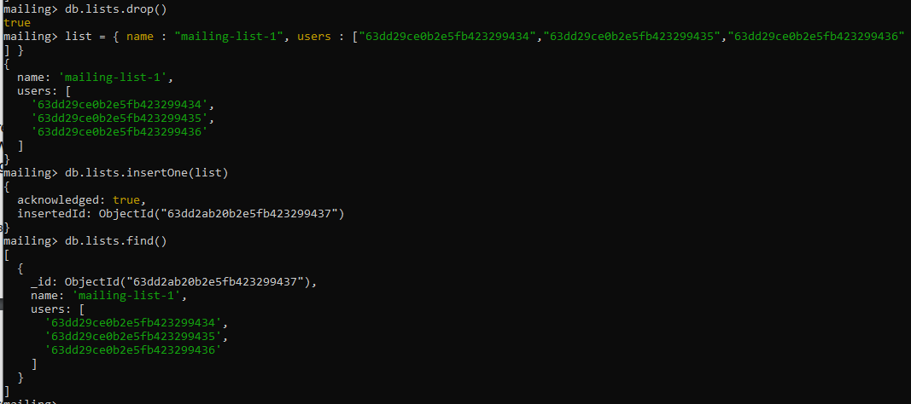

Je code maintenant un script python nommé **get_mailing_list.py** permettant de récupérer un document dans la collection **lists** par son nom et les documents de chaque utilisateurs présent dans l'attribut **users** en parcourant les id:

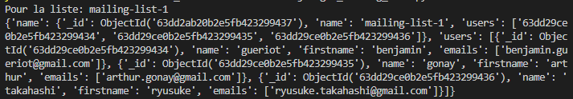

# 12/ Ajout d'utilisateurs

Il est important de contrôler les accès, ainsi il faut créer des utilisateur, deux méthodes sont possible par ligne de commande ou avec Robo3T:

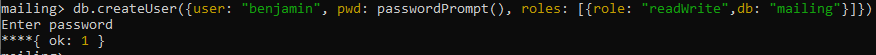

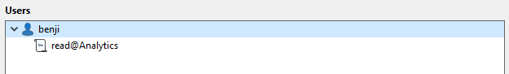

# 13/ Map Reduce

Afin de réaliser un Map Reduce qui compte le nombre de communes dans le 84, on met en place les méthodes suivantes:

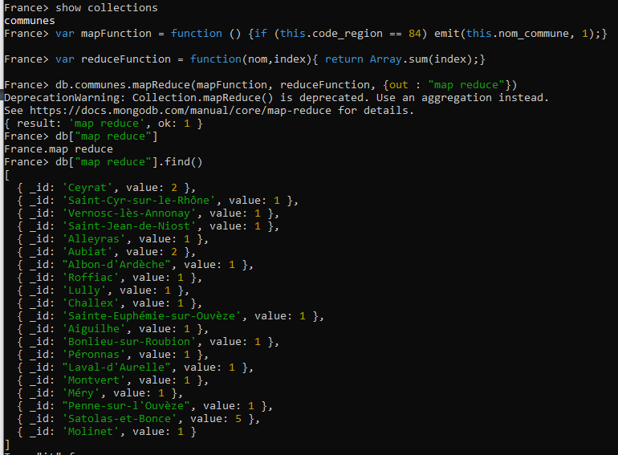

# 14/ Sauvegarde et restauration des données

Je cherche maitenant à effectuer des backup de ma base de données:

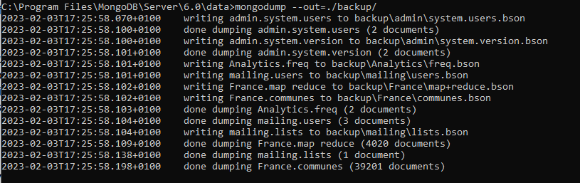

Afin de restauré cette backup on lance la commande suivante :
```shell
mongorestore backup/
```

# 15/ Agrégation

Nous cherchons maintenant aà créer des **pipeline** de traitement de données.

J'importe dans un premier temps les données dans MongoDB/

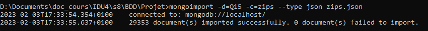

Je réalise maitenant l'ensemble des exemples du tutoriel:

* ### **Agrégation simple:**

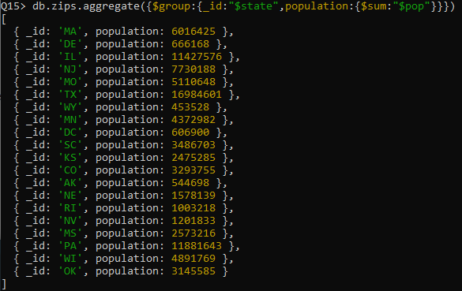

* ### **Agrégation simple avec trie:**


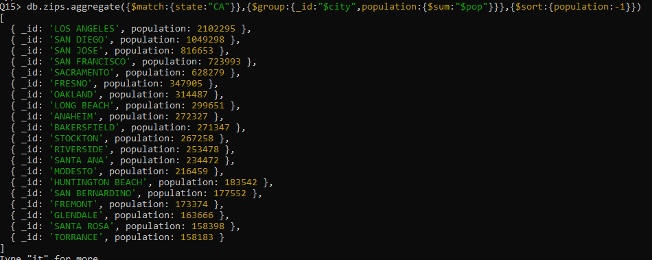

* ### **Pipeline d'agrégation:**

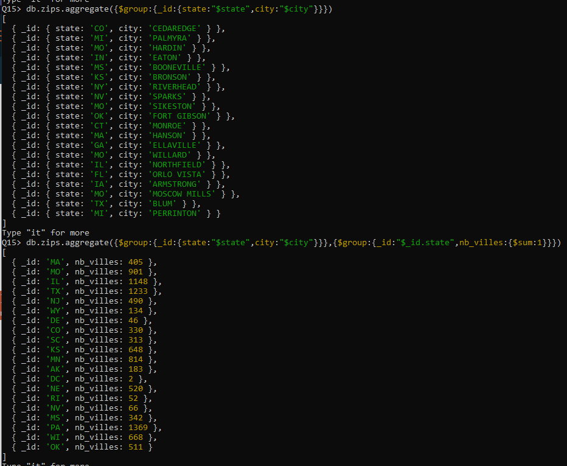
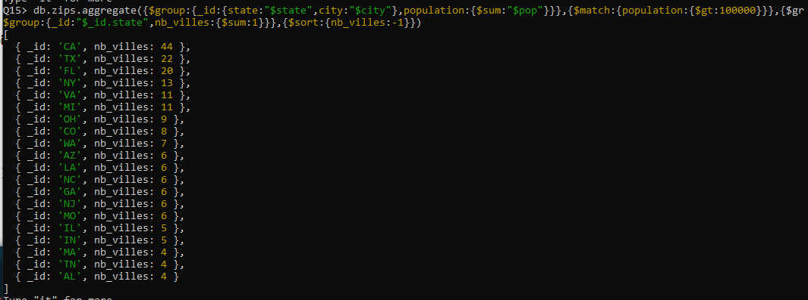

* ### **Limitations:**

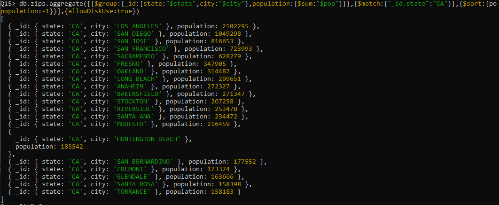
